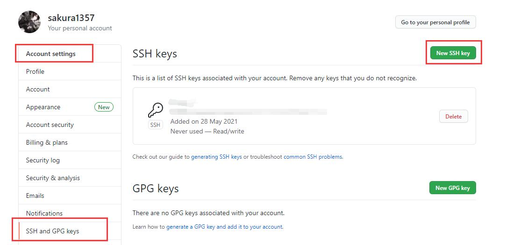
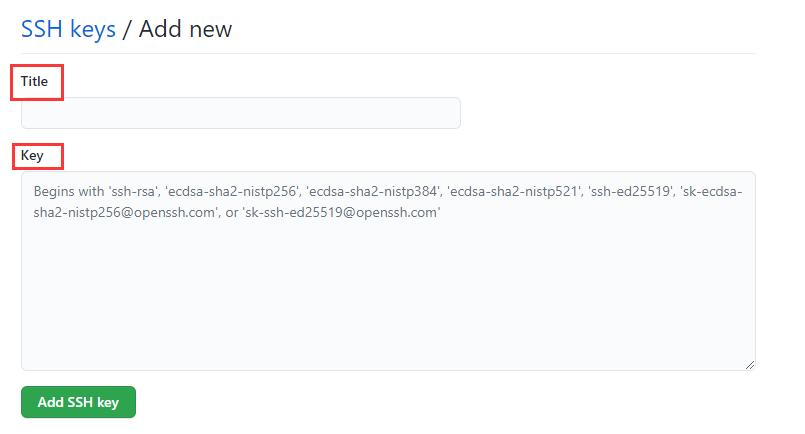

# Git 常用命令
> 记忆力有限，每次用的时候都要搜索查一下，还不如自己写写总结一下，方便自己回看。

## 1. ssh-key 认证配置
>配置密钥认证，防止每次push都要输入GitHub账号密码
### 1) 本地端配置
```bash
# 
# 生成ssh-key，回车三次，放到默认路径即可
ssh-keygen -t rsa -C "yourmail"
# 私钥：/c/Users/当前用户/.ssh/id_isa
# 公钥：/c/Users/当前用户/.ssh/id_isa.pub
```
### 2) Github 页面配置
登录Github，打开个人账户设置 `Account settings`， 选择 `SSH and GPG keys`，点击右上角 `New SSH key`


将上面生成的 `id_isa.pub` 里面的内容复制到 `key` 里面即可，`Title` 自己随便起一个名字，如果有多台设备，建议按照设备名称或者用途命名。


这样就配置好了。未完待续...